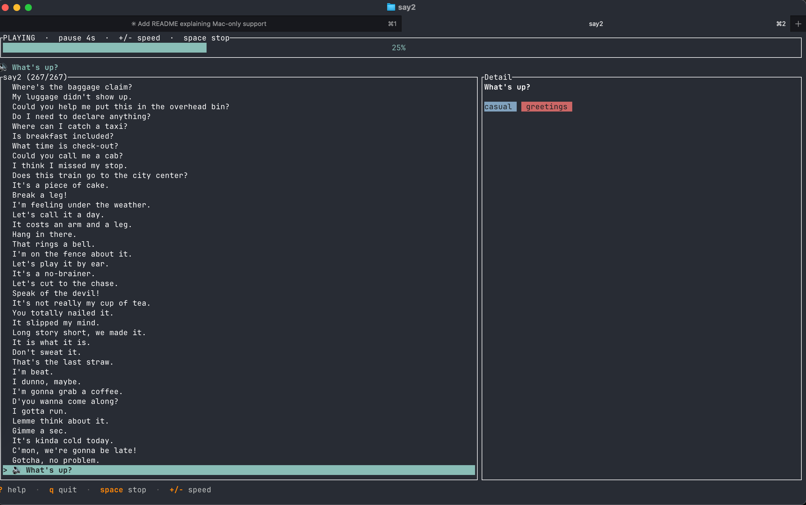

# say2

A terminal app for drilling everyday English sentences. Browse a library of
phrases, hear them read aloud, and run a hands-free "play" mode that speaks
random sentences on a loop so you can practise listening and repeating.

> ⚠️ **Content warning.** The bundled `sentences.toml` is a personal learning
> deck and may contain slang, informal, or vulgar expressions used as language
> examples. Edit or replace it to suit your own taste.



## macOS only

**say2 works on macOS only.** Speech is produced by shelling out to the
built-in [`say`](https://ss64.com/mac/say.html) command, which ships with
macOS. There is no fallback for Linux or Windows — on those platforms the UI
runs but nothing is spoken (the `say` process simply fails to launch).

The Settings screen exposes the macOS-specific `say -v <voice>` and
`say -r <rate>` flags, so voices are the ones installed under
**System Settings → Accessibility → Spoken Content**.

## Install (no coding experience needed)

You don't need to know how to program. Just open the **Terminal** app
(press `⌘ + Space`, type "Terminal", hit Enter) and copy-paste each block
below, one at a time, pressing Enter after each.

**1. Install Rust** (the toolchain that builds the app). Paste this and follow
the prompts — pressing Enter to accept the defaults is fine:

```sh
curl --proto '=https' --tlsv1.2 -sSf https://sh.rustup.rs | sh
```

When it finishes, close and reopen Terminal so it picks up the new tools.

**2. Download say2:**

```sh
git clone https://github.com/nseaSeb/say2.git
cd say2
```

> No `git`? macOS will offer to install it the first time you run the command —
> click **Install** and wait, then run the two lines again. Alternatively,
> download the project as a ZIP from the GitHub page (green **Code** button →
> **Download ZIP**), unzip it, and drag the folder into Terminal after typing
> `cd ` to get its path.

**3. Run the installer:**

```sh
./install.sh
```

It builds the app, installs it, and loads the sentence deck. It will ask for
your Mac password once (to place the program where your system can find it) —
this is normal.

**4. Start it anytime** by opening Terminal and typing:

```sh
say2
```

That's it. To update later, run `git pull` inside the `say2` folder and
`./install.sh` again.

---

### For developers

Run straight from source without installing:

```sh
cargo run --release
```

Manual install instead of the script:

```sh
cargo build --release                       # binary -> target/release/say2
sudo cp target/release/say2 /usr/local/bin/ # put it on your PATH
mkdir -p ~/.config/say2                      # optional: seed the deck
cp sentences.toml ~/.config/say2/sentences.toml
```

## Sentence deck

say2 reads its sentences from `~/.config/say2/sentences.toml` — **not** from
the `sentences.toml` in this repo. On first launch, if that config file is
missing, say2 writes a tiny built-in starter set (a few sentences) so the app
works out of the box.

The richer `sentences.toml` shipped in this repo is **not** loaded
automatically. To use it, copy it into place (step 3 above, or via
`install.sh`). After that, edit the file directly or manage sentences from
inside the app (`a` add, `e` edit, `d` delete).

## Keys

| Key            | Action                                   |
| -------------- | ---------------------------------------- |
| `j` / `k`, ↑/↓ | move selection                           |
| `p` / `Enter`  | speak the selected sentence              |
| `space`        | play / stop auto mode                    |
| `/`            | search (by text or tag)                  |
| `a`            | add a sentence                           |
| `e`            | edit the selected sentence               |
| `d`            | delete the selected sentence             |
| `m`            | star / unstar (starred plays more often) |
| `s`            | settings (voice / rate / star weight)    |
| `+` / `-`      | pause length between auto-played lines   |
| `?`            | help                                     |
| `q`            | quit                                     |
